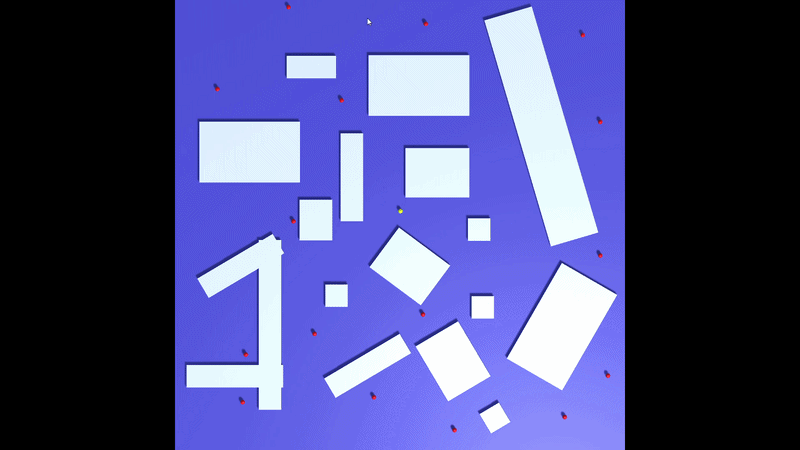
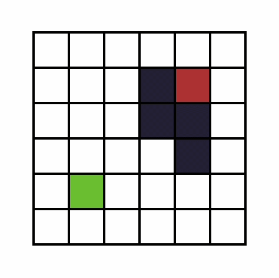
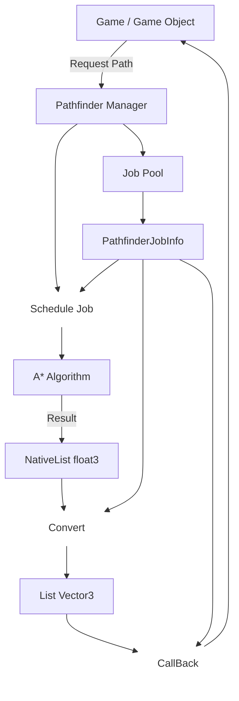

# A* Pathfinding Algorithm in Unity



A Pathfinding System made in Unity.

An A* Pathfinding implementation made for Unity using the Jobs System and native collections, designed to calculate paths asynchronously.

## What is A*?

The A* is a maze-solving or pathfinding algorithm. By giving it a grid with obstacles, it is able to find the shortest path between a start node and a target node.

The way it works is that each node of the grid has 3 values:
* The G value, it represents the distance between the start node and the current node.
* The H value, this one represents the distance between the current node and the target node, this is not a precise value as it does not keep track of the obstacles.
* The F value, this is the sum between the G and the H values.

The algorithm revolves around a single loop that iterates through a list of Nodes, this list starts with only one element, the starting node, inside the loop the algorithm will pick the node with the lowest F value, or if they are tied it will pick the one with the lowest H value.\
This node is then removed from the list and added to another list containing the checked nodes. Then it will get the neighbors of the selected node, discarding any node that is considered an obstacle node, the algorithm will iterate through each neighbor and calculate the distance between it and the selected node.\
The distance value is either 10, if the neighbor is located horizontally or vertically next to the selected node, or 14 if it is located diagonally next to it.\
Given this rule, the method to calculate the distance is:

```C#

readonly int CalculateDistance(PathNode nodeA, PathNode nodeB)
{
    int distanceX = math.abs(nodeA.x - nodeB.x);
    int distanceZ = math.abs(nodeA.z - nodeB.z);

    if (distanceZ < distanceX)
        return 14 * distanceZ + 10 * (distanceX - distanceZ);
    
    return 14 * distanceX + 10 * (distanceZ - distanceX);
}

```

After the distance is calculated the result will be summed with the G value of the selected node, if the new value is lower than the G value of the neighbor, or if the neighbor is not in the list of nodes to be checked, the new value will become neighbor's G value. After, the algorithm will use the same method to calculate the distance between the neighbor and the target node, this will be the H value of the neighbor, Lastly it will add the neighbor node in the list of nodes to be checked.

This is what happens at every iteration and it will continue until either the list of nodes to check is emptied, at which point the algorithm will end with the target node being unreachable, or it will end when one of the selected node is the target node, if this is the case the algorithm will retrace the path it took until reaching again the starting node. The result will be the shortest path possible between the starting point and the target point.



## Technical Highlights

### Unity Job System

The [Pathfinding](https://github.com/Riky-17/PathfinderUnity/blob/b430c30d80338336efcd993964888c6fda98067f/AStarPathfinding/Assets/Scripts/PathFinder/Pathfinder.cs#L83-L156) part of the algorithm is made using Unity's Jobs System, so that multiple paths can be calculated asynchronously

### Job Pooling

In order to avoid creating multiple classes every time a path is requested, the algorithm uses an [Object pool](https://github.com/Riky-17/PathfinderUnity/blob/main/AStarPathfinding/Assets/Scripts/ObjectPool.cs) for the `PathFinderJobInfo` class

### A* Implementation

In my implementation of the A* algorithm i use a `NativeHashMap<(int, int), int>` to keep track of the indices, this is so that the algorithm can use a circular grid as well, that's because a circular grid may have some missing node coordinates.\
Another difference in my implementation is that, when checking the neighbors of the current node, i also check if a [neighbor is past a corner](https://github.com/Riky-17/PathfinderUnity/blob/765f2f4a37caffc2765be9678c3975ffb3ebcba3/AStarPathfinding/Assets/Scripts/PathFinder/Pathfinder.cs#L216-L229), and if it is, the algorithm will not treat it as a reachable node from the current node. The reason for this, is because if a neighbor is past a corner, in the final path result, the object following the path may go inside the corner.

## Code Flow



## Code Explanation

### PathNode

The [PathNode](https://github.com/Riky-17/PathfinderUnity/blob/main/AStarPathfinding/Assets/Scripts/PathFinder/PathNode.cs) is a struct which represents every node of the grid. Since the algorithm uses Unity's Job System to multithread the algorithm, the PathNode needs to be a struct in order to be passed to the multithread part of the algorithm.

```C#

public struct PathNode : IEquatable<PathNode>
{
    public float3 nodePos;
    public int x;
    public int z;
    public bool IsWalkable;
    
    public int index;

    public int gCost;
    public int hCost;
    public readonly int FCost => gCost + hCost;

    public int parentNode;

    public PathNode(float3 nodePos, bool IsWalkable, int x, int z, int nodeIndex)
    {
        this.nodePos = nodePos;
        this.IsWalkable = IsWalkable;
        this.x = x;
        this.z = z;
        index = nodeIndex;
        gCost = 0;
        hCost = 0;
        parentNode = -1;
    }

    public override readonly bool Equals(object obj)
    {
        if(obj is PathNode other)
            return this == other;
        return false;
    }

    public override readonly int GetHashCode() => HashCode.Combine(x + z);
    public readonly bool Equals(PathNode other) => this == other;

    public static bool operator ==(PathNode left, PathNode right) => left.x == right.x && left.z == right.z; 
    public static bool operator !=(PathNode left, PathNode right) => !(left == right); 
}

```

The node keeps track of its `x` and `z` coordinates, its `index` in the grid array, as well as its `GCost`, `HCost` and `FCost`, lastly the `parentNode` value holds the index of the node that lead to this node, this will be used at the end of the algorithm to retrace the path when the target node is reached.

### PathFinderJobInfo

The [PathFinderJobInfo](https://github.com/Riky-17/PathfinderUnity/blob/main/AStarPathfinding/Assets/Scripts/PathFinder/PathFinderJobInfo.cs) is a class that is used as a container to hold information of the `JobHandle` that manages the Job request, as well as the callback that is called to pass the result of the Job back to the script that requested it.

```C#

public class PathFinderJobInfo
{
    PathFinderJob job;
    JobHandle jobHandle;
    PathfinderRequest request;
    NativeList<PathNode> gridNodes;
    NativeList<float3> jobResult;
    NativeHashMap<(int, int), int> nodesIndexes;
    public List<Vector3> path;

    public PathFinderJobInfo() {}

    public PathFinderJobInfo(PathfinderRequest request) => SetUpRequest(request);

    public void SetUpRequest(PathfinderRequest request)
    {
        this.request = request;

        jobResult = new(Allocator.Persistent);
        gridNodes = new(Allocator.Persistent);
        nodesIndexes = new(request.grid.Count, Allocator.Persistent);

        foreach (PathNode node in request.grid)
        {
            gridNodes.Add(node);
            nodesIndexes.Add((node.x, node.z), node.index);
        }

        job = new()
        {
            nodesAmountX = Mathf.RoundToInt(request.gridHalfSize.x * 2 / (request.nodeRadius * 2)),
            nodesAmountZ = Mathf.RoundToInt(request.gridHalfSize.y * 2 / (request.nodeRadius * 2)),
            gridHalfSize = request.gridHalfSize,
            centerPos = request.gridCenter,

            startingPos = request.startPos,
            targetPos = request.targetPos,

            gridNodes = gridNodes,
            nodesIndices = nodesIndexes,
            path = jobResult,
        };
    }
}

```

At every Update, a List containing all of the active Job requests will be iterated to check if any Job is completed:

```C#

void Update()
{
    for (int i = pathFinderJobs.Count - 1; i >= 0 ; i--)
    {
        PathFinderJobInfo job = pathFinderJobs[i];
        if(job.IsComplete())
        {
            pathfinderJobPool.ReturnToPool(job);
            pathFinderJobs.RemoveAt(i);
        }
    }
}

```
If any Job is done, it will then be sent back to the pool, where the following method of the PathFinderJobInfo class will be called:

```C#

public void CompleteJob()
{
    jobHandle.Complete();
    path = new();

    foreach (float3 pos in jobResult)
        path.Add(pos);
        
    jobResult.Dispose();
    gridNodes.Dispose();
    nodesIndexes.Dispose();

    request.callback(path);
}

```

This method will convert the `NativeList<float3>` into a `List<Vector3>`, which will then be sent to the script that requested the path, as well as disposing any Persistent Native collection.